```r
# ===============================================================================
# Name     : 
# Author   : Filippo Ferrario
# Date     : 12-01-2023 [dd-mm-yyyy]
# Version  : 
# URL      : 
# Aim      : Test script by Jillian. My edits are commented as # FF
# ===============================================================================

# FF {
setwd('./Telemetry_')
```

```
## Error in setwd("./Telemetry_"): cannot change working directory
```

```r
# }


library(filterTD)
library(dplyr)
library(scales)
#  CHANGE NAME eventually to include: telemetry, fine-scale or VPS

# Choose tag data file (all or just animal depending on year)
# Tags = file.choose() 
Tags ='all-animals_2020.csv' # FF
all_tags <- read.table(file = Tags, header=TRUE, sep=",") #Read file


# FF {
str(all_tags)# FF
```

```
## 'data.frame':	855768 obs. of  21 variables:
##  $ FullId     : chr  "A69-1602-15048" "A69-1602-18032" "A69-1602-15048" "A69-1602-18032" ...
##  $ Id         : int  15048 18032 15048 18032 15048 15048 15048 15048 15048 18032 ...
##  $ Time       : chr  "2020-06-30 13:29:31.161475" "2020-06-30 13:32:20.615763" "2020-06-30 13:33:12.353024" "2020-06-30 13:36:57.209603" ...
##  $ X          : num  3392 3510 3390 3509 3401 ...
##  $ Y          : num  2987 3255 2987 3258 2978 ...
##  $ Z          : num  -16.6 -16.6 -16.6 -16.6 -16.6 -16.6 -16.6 -16.6 -16.6 -16.6 ...
##  $ Longitude  : num  -64.6 -64.6 -64.6 -64.6 -64.6 ...
##  $ Latitude   : num  44 44 44 44 44 ...
##  $ Depth      : num  16.6 16.6 16.6 16.6 16.6 16.6 16.6 16.6 16.6 16.6 ...
##  $ Station    : logi  NA NA NA NA NA NA ...
##  $ HPE        : num  2.75 1.06 1.68 1.26 5.1 ...
##  $ HPEm       : logi  NA NA NA NA NA NA ...
##  $ RMSE       : num  0 0.601148 0.349725 0.000138 0 ...
##  $ TempData   : logi  NA NA NA NA NA NA ...
##  $ DepthData  : logi  NA NA NA NA NA NA ...
##  $ AccelData  : logi  NA NA NA NA NA NA ...
##  $ nBasic     : int  1 3 3 1 1 18 7 15 16 2 ...
##  $ RxDetected : chr  "548599 548570 547439" "548570 548561 548557 548599" "548599 548570 547439 548557" "548570 548561 548557" ...
##  $ nRxDetected: int  3 4 4 3 3 9 5 6 6 4 ...
##  $ RxUsed     : chr  "548599 548570 547439" "548570 548561 548557 548599" "548599 548570 547439 548557" "548570 548561 548557" ...
##  $ nRxUsed    : int  3 4 4 3 3 6 5 6 6 4 ...
```

```r
head(all_tags)
```

```
##           FullId    Id                       Time        X        Y     Z Longitude Latitude Depth Station       HPE HPEm        RMSE TempData DepthData
## 1 A69-1602-15048 15048 2020-06-30 13:29:31.161475 3392.343 2986.937 -16.6 -64.64956 44.03580  16.6      NA 2.7524151   NA 0.000000000       NA        NA
## 2 A69-1602-18032 18032 2020-06-30 13:32:20.615763 3510.158 3255.200 -16.6 -64.64809 44.03822  16.6      NA 1.0598900   NA 0.601147638       NA        NA
## 3 A69-1602-15048 15048 2020-06-30 13:33:12.353024 3390.307 2986.616 -16.6 -64.64958 44.03580  16.6      NA 1.6846379   NA 0.349724746       NA        NA
## 4 A69-1602-18032 18032 2020-06-30 13:36:57.209603 3508.534 3257.946 -16.6 -64.64811 44.03824  16.6      NA 1.2583764   NA 0.000137651       NA        NA
## 5 A69-1602-15048 15048 2020-06-30 13:41:06.629852 3401.024 2978.289 -16.6 -64.64945 44.03572  16.6      NA 5.1040896   NA 0.000000000       NA        NA
## 6 A69-1602-15048 15048 2020-06-30 13:45:13.625876 3396.937 2987.715 -16.6 -64.64950 44.03581  16.6      NA 0.4214876   NA 1.785040639       NA        NA
##   AccelData nBasic                                                     RxDetected nRxDetected                                    RxUsed nRxUsed
## 1        NA      1                                           548599 548570 547439           3                      548599 548570 547439       3
## 2        NA      3                                    548570 548561 548557 548599           4               548570 548561 548557 548599       4
## 3        NA      3                                    548599 548570 547439 548557           4               548599 548570 547439 548557       4
## 4        NA      1                                           548570 548561 548557           3                      548570 548561 548557       3
## 5        NA      1                                           548599 547439 547441           3                      548599 547439 547441       3
## 6        NA     18 548597 548577 548599 548570 547439 548557 548589 548561 547443           9 548597 548577 548599 548570 547439 548557       6
```

```r
# }


# Choose data file that has sync tags (use depending on year)
# SyncTags = file.choose()
SyncTags = "all-sync_2020.csv" # FF
other_tags <- read.table(file = SyncTags, header=TRUE, sep=",")

# FF {
str(other_tags)# FF
```

```
## 'data.frame':	1478898 obs. of  21 variables:
##  $ FullId     : chr  "A69-1601-61034" "A69-1601-61021" "A69-1601-61025" "A69-1601-61016" ...
##  $ Id         : int  61034 61021 61025 61016 61052 61026 61909 61046 61014 61022 ...
##  $ Time       : chr  "2020-06-30 13:24:34.593880" "2020-06-30 13:25:36.034286" "2020-06-30 13:25:46.925763" "2020-06-30 13:26:09.905033" ...
##  $ X          : num  3462 3752 3639 3928 4016 ...
##  $ Y          : num  3244 3142 3403 2745 3050 ...
##  $ Z          : num  -17.3 -19 -15.5 -23.4 -21 -26.5 -26.6 -24 -27.8 -28.3 ...
##  $ Longitude  : num  -64.6 -64.6 -64.6 -64.6 -64.6 ...
##  $ Latitude   : num  44 44 44 44 44 ...
##  $ Depth      : num  17.3 19 15.5 23.4 21 26.5 26.6 24 27.8 28.3 ...
##  $ Station    : chr  "ST66" "ST67" "ST72" "ST63" ...
##  $ HPE        : num  2.528 0.584 4.024 0.582 0.921 ...
##  $ HPEm       : num  3.79 3.92 15.2 2.5 3.22 ...
##  $ RMSE       : num  2.06 2.4 8.25 1.31 0.9 ...
##  $ TempData   : logi  NA NA NA NA NA NA ...
##  $ DepthData  : logi  NA NA NA NA NA NA ...
##  $ AccelData  : logi  NA NA NA NA NA NA ...
##  $ nBasic     : int  2 8 2 16 6 4 9 7 9 11 ...
##  $ RxDetected : chr  "548570 548561 548557 548599 548588" "548557 548588 548599 548561 548570 548582" "548561 548570 548557 548588 548599" "548588 548599 548582 548562 548557 548569 548570 548584" ...
##  $ nRxDetected: int  5 6 5 8 9 6 5 7 5 8 ...
##  $ RxUsed     : chr  "548561 548557 548599 548588" "548588 548599 548561 548570 548582" "548570 548557 548588 548599" "548588 548599 548582 548562 548557 548569" ...
##  $ nRxUsed    : int  4 5 4 6 5 6 5 5 5 6 ...
```

```r
head(other_tags)
```

```
##           FullId    Id                       Time        X        Y     Z Longitude Latitude Depth Station       HPE      HPEm      RMSE TempData DepthData
## 1 A69-1601-61034 61034 2020-06-30 13:24:34.593880 3462.125 3243.625 -17.3 -64.64868 44.03811  17.3    ST66 2.5281774  3.789269 2.0593227       NA        NA
## 2 A69-1601-61021 61021 2020-06-30 13:25:36.034286 3752.378 3142.177 -19.0 -64.64506 44.03720  19.0    ST67 0.5841347  3.920990 2.4013184       NA        NA
## 3 A69-1601-61025 61025 2020-06-30 13:25:46.925763 3638.615 3402.684 -15.5 -64.64648 44.03954  15.5    ST72 4.0244820 15.203305 8.2535404       NA        NA
## 4 A69-1601-61016 61016 2020-06-30 13:26:09.905033 3928.121 2745.241 -23.4 -64.64287 44.03363  23.4    ST63 0.5817478  2.501088 1.3088851       NA        NA
## 5 A69-1601-61052 61052 2020-06-30 13:26:18.160397 4015.968 3050.261 -21.0 -64.64178 44.03637  21.0    ST68 0.9207469  3.223150 0.9000257       NA        NA
## 6 A69-1601-61026 61026 2020-06-30 13:26:27.626247 4186.853 2471.188 -26.5 -64.63964 44.03116  26.5   ST100 4.7651111 16.791846 1.3037125       NA        NA
##   AccelData nBasic                                                     RxDetected nRxDetected                                    RxUsed nRxUsed
## 1        NA      2                             548570 548561 548557 548599 548588           5               548561 548557 548599 548588       4
## 2        NA      8                      548557 548588 548599 548561 548570 548582           6        548588 548599 548561 548570 548582       5
## 3        NA      2                             548561 548570 548557 548588 548599           5               548570 548557 548588 548599       4
## 4        NA     16        548588 548599 548582 548562 548557 548569 548570 548584           8 548588 548599 548582 548562 548557 548569       6
## 5        NA      6 548588 548557 548552 548582 548599 548561 548562 548570 548569           9        548557 548552 548582 548599 548561       5
## 6        NA      4                      548562 548582 548552 548569 548599 548557           6 548562 548582 548552 548569 548599 548557       6
```

```r
# }

# Choose metadata file
# MetaData = file.choose()
MetaData= "Metadata_animals2020.csv" # FF
metadata <- read.table(file = MetaData, header=TRUE, sep=";")

# FF {
str(metadata)# FF
```

```
## 'data.frame':	197 obs. of  9 variables:
##  $ Id      : int  54211 54212 54213 54214 54215 54216 54217 54218 54219 54220 ...
##  $ Year    : int  2020 2020 2020 2020 2020 2020 2020 2020 2020 2020 ...
##  $ Tag_Date: chr  "2020-07-14" "2020-07-14" "2020-07-14" "2020-07-14" ...
##  $ Tag_Lat : num  44 44 44 44 44 ...
##  $ Tag_Long: num  -64.7 -64.7 -64.6 -64.6 -64.6 ...
##  $ Sex     : chr  "M" "M" "F" "F" ...
##  $ Size    : num  0.119 0.09 0.12 0.084 0.09 0.084 0.083 0.104 0.105 0.086 ...
##  $ Sp      : chr  "Cancer irroratus" "Homarus americanus" "Homarus americanus" "Homarus americanus" ...
##  $ Site    : chr  "Mersey Point" "Mersey Point" "Farm" "Farm" ...
```

```r
head(metadata)
```

```
##      Id Year   Tag_Date  Tag_Lat  Tag_Long Sex  Size                 Sp         Site
## 1 54211 2020 2020-07-14 44.02805 -64.66813   M 0.119   Cancer irroratus Mersey Point
## 2 54212 2020 2020-07-14 44.02822 -64.66813   M 0.090 Homarus americanus Mersey Point
## 3 54213 2020 2020-07-14 44.04202 -64.63687   F 0.120 Homarus americanus         Farm
## 4 54214 2020 2020-07-14 44.04202 -64.63687   F 0.084 Homarus americanus         Farm
## 5 54215 2020 2020-07-14 44.04202 -64.63687   M 0.090 Homarus americanus         Farm
## 6 54216 2020 2020-07-14 44.04202 -64.63687   M 0.084 Homarus americanus         Farm
```

```r
# }

ani_tags <- unique(all_tags$Id)
  # 2016 data
  #c(45195, 45198, 45199, 45197, 45196, 45200, 45202, 45203)
              # '45201', '45204', '45206', '45205', '45209', '45218', '45212', '45220',
              # '45211', '45213', '45207', '45221', '45219', '45217', '45210', '45208',
              # '45223', '45215', '45222', '45216', '45214', '46103', '46101', '46096',
              # '46094', '45457', '45456', '45455', '46102', '45458', '46095', '46100',
              # '46099', '46087', '46098', '46083', '46093', '46081', '46080', '46091',
              # '46097', '46092', '46090', '46089', '46082', '46085', '46088', '46084',
              # '46086')

non_ref <- subset(other_tags, Id!=65321 & Id!=65322)
sync_tags <- unique(non_ref$Id)
  # 2016 data
  #c(65070, 65052, 65067, 65106, 65075, 65055, 65105, 65066)
               # '65085', '65101', '65099', '65008', '65062', '65094', '65095', '65089',
               # '65064', '65103', '65087', '65068', '65056', '65073', '65081', '65009',
               # '65079', '65083', '65012', '65069')
ref_tags <- c(65321, 65322)
  # 2016 data
  #c(16288)


# Testing subsetting tags
test_ <- subset.tags(tags = all_tags,
                     sync_tags = other_tags,
                     id_col = "Id",
                     sync_tags.vec = sync_tags,
                     ref_tags.vec = ref_tags,
                     ani_tags.vec = ani_tags)

animal_tag_data <- data.frame(test_[1])
sync_tag_data <- data.frame(test_[2])
ref_tag_data <- data.frame(test_[3])

anitags_200 <- filter.numdet(animal_tag_data$Id, 200)

# Testing the number of observations per tag
stats <- num.obs.per.tag(animal_tag_data, "Id", graph=FALSE)
all_obs <- stats[1]
all_tags <- stats[2]

animal_merged <- merge(animal_tag_data, metadata, by = "Id")

num_obs_per_tag_lob <- num.obs.per.tag(animal_merged, "Id", graph=TRUE,
                                       sp="Homarus americanus", sp_col_name="Sp",
                                       metadata=metadata)
```

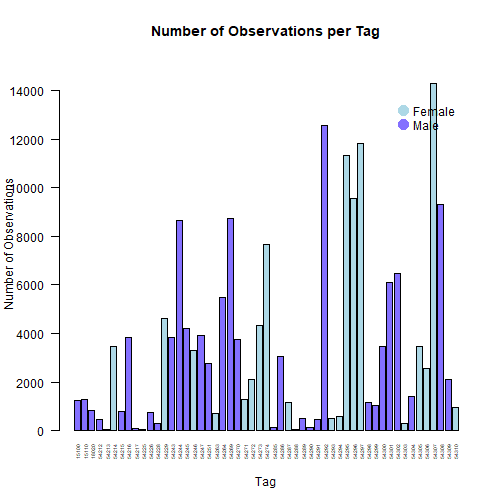


## FF TEST 
**ATTENTION** the line above is the same as just setting grouping 
**maybe remove** @param related to sp and sex to just leave grouping


```r
head(animal_merged )
```

```
##      Id         FullId                       Time        X        Y     Z Longitude Latitude Depth Station       HPE HPEm      RMSE TempData DepthData
## 1 15048 A69-1602-15048 2020-08-18 05:10:51.247989 2802.029 2015.491 -16.6 -64.65692 44.02706  16.6      NA 2.3174845   NA 0.0000000       NA        NA
## 2 15048 A69-1602-15048 2020-08-04 08:09:05.864982 3510.463 2807.885 -16.6 -64.64808 44.03419  16.6      NA 1.5184474   NA 1.2437621       NA        NA
## 3 15048 A69-1602-15048 2020-07-29 11:04:12.601406 3219.939 3003.103 -16.6 -64.65171 44.03595  16.6      NA 1.4150395   NA 1.3557652       NA        NA
## 4 15048 A69-1602-15048 2020-08-11 11:47:00.241254 2493.867 2148.226 -16.6 -64.66076 44.02825  16.6      NA 0.4048026   NA 0.6953471       NA        NA
## 5 15048 A69-1602-15048 2020-08-19 19:13:54.545330 3460.922 2602.110 -16.6 -64.64870 44.03234  16.6      NA 0.6765923   NA 0.5072398       NA        NA
## 6 15048 A69-1602-15048 2020-09-12 17:29:18.456023 3420.605 1937.488 -16.6 -64.64920 44.02636  16.6      NA 0.4676683   NA 2.1244227       NA        NA
##   AccelData nBasic                                                            RxDetected nRxDetected                                    RxUsed nRxUsed Year
## 1        NA      1                                                  548593 547438 547444           3                      548593 547438 547444       3 2019
## 2        NA      6                             548577 548597 547441 548570 548566 548596           6 548577 548597 547441 548570 548566 548596       6 2019
## 3        NA      7                             548577 548570 548599 547439 548561 548565           6 548577 548570 548599 547439 548561 548565       6 2019
## 4        NA     15 547444 548573 548603 546689 548593 548553 548598 548563 548596 548567          10 547444 548573 548603 546689 548593 548553       6 2019
## 5        NA     12               547441 548599 548596 548572 548566 547438 548584 548561           8 547441 548599 548596 548572 548566 547438       6 2019
## 6        NA     14        548572 548579 548550 548584 548563 548596 547445 548558 548603           9 548572 548579 548550 548584 548563 548596       6 2019
##     Tag_Date Tag_Lat  Tag_Long Sex    Size               Sp         Site
## 1 2019-07-20 44.0302 -64.67837   M 0.11541 Cancer irroratus Mersey Point
## 2 2019-07-20 44.0302 -64.67837   M 0.11541 Cancer irroratus Mersey Point
## 3 2019-07-20 44.0302 -64.67837   M 0.11541 Cancer irroratus Mersey Point
## 4 2019-07-20 44.0302 -64.67837   M 0.11541 Cancer irroratus Mersey Point
## 5 2019-07-20 44.0302 -64.67837   M 0.11541 Cancer irroratus Mersey Point
## 6 2019-07-20 44.0302 -64.67837   M 0.11541 Cancer irroratus Mersey Point
```

```r
num.obs.per.tag(animal_merged, "Id", graph=TRUE,
                                       grouping="Homarus americanus", grouping_col_name="Sp",
                                       metadata=metadata)
```


```
## [1] 182927     53
```

the function whorks even if there is no SEX column... tha is ok I guess


```r
num.obs.per.tag(animal_merged[,names(animal_merged)!="Sex"], "Id", graph=TRUE,
                                       grouping="Homarus americanus", grouping_col_name="Sp",
                                       metadata=metadata[,names(metadata)!="Sex"])
```

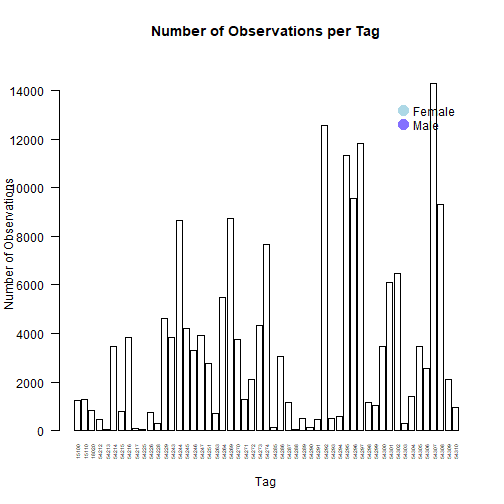

```
## [1] 182927     53
```

```r
num.obs.per.tag(animal_merged, "Id", graph=TRUE,
                                       grouping='M', grouping_col_name="Sex",
                                       metadata=metadata)
```

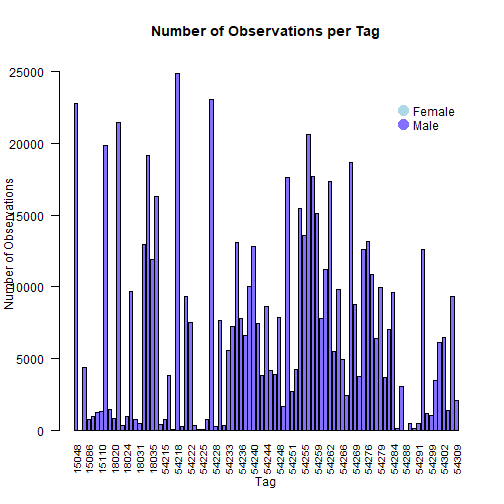

```
## [1] 646732     91
```

possiby here if someone does not specify a specific group in grouping than all levels of the group are returned...  
Anyhow, it should clarified that in "grouping" the user need to enter the character string of the level s/he wants.  


```r
num_obs_lob <- num_obs_per_tag_lob[1]
num_tags_lob <- num_obs_per_tag_lob[2]

num_obs_per_tag_crab <- num.obs.per.tag(animal_merged, "Id", graph=TRUE,
                                        sp="Cancer irroratus", sp_col_name="Sp",
                                        metadata=metadata)
```

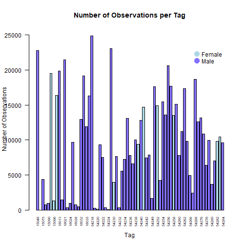

```r
num_obs_crab <- num_obs_per_tag_crab[1]
num_tags_crab <- num_obs_per_tag_crab[2]

lob_test <- num.obs.per.tag(animal_merged, "Id", graph=TRUE,
                            sp="Cancer irroratus", sp_col_name="Sp",
                            sex="F", sex_col_name="Sex")
```

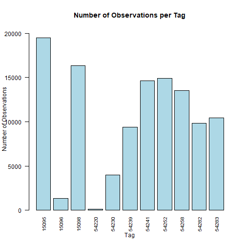

```r
scatter_test <- num.obs.per.tag(animal_merged, "Id", scatterplot=TRUE,
                                sp="Cancer irroratus", sp_col_name="Sp",
                                metadata=metadata, size_col_name="Size")
```

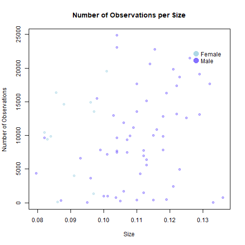

```r
#  -------------------------------
```

## FF TEST 
scatterplot has priority on bargraph: 


```r
scatter_test <- num.obs.per.tag(animal_merged, "Id", scatterplot=TRUE, graph=TRUE,
                                sp="Cancer irroratus", sp_col_name="Sp",
                                metadata=metadata, size_col_name="Size")
```

```
## Warning in rbind(deparse.level, ...): number of columns of result, 10, is not a multiple of vector length 69 of arg 2
```

```
## Error in fix.by(by.x, x): 'by' must specify a uniquely valid column
```

Wierd: plot the graph but then throws an error


as it is the function assume that there is a size variable and that this is use as th X asis...  
what if I do not have the size info?  
Maybe there are cases where one could be interested in a scatter plot with another variable:  
I would have the function asking which variable to use as X axis and not assume that there is a column "Size"


```r
scatter_test <- num.obs.per.tag(animal_merged[,names(animal_merged)!="Size"], "Id", scatterplot=TRUE, graph=TRUE,
                                sp="Cancer irroratus", sp_col_name="Sp",
                                metadata=metadata[,names(metadata)!="Size"], size_col_name="Size")
```

```
## Warning in rbind(deparse.level, ...): number of columns of result, 9, is not a multiple of vector length 69 of arg 2
```

```
## Error in fix.by(by.x, x): 'by' must specify a uniquely valid column
```
Wierd: plot the graph but then throws an error


```r
timeframe_test_week <- num.obs.per.tag(animal_merged, "Id",
                                  sp="Cancer irroratus", sp_col_name="Sp",
                                  metadata=metadata,
                                  start_date="2022-06-30", end_date="2020-07-24",
                                  time_interval="week", time_col_name="Time")

timeframe_test_month <- num.obs.per.tag(animal_merged, "Id",
                                        sp="Cancer irroratus", sp_col_name="Sp",
                                        metadata=metadata,
                                        start_date="2022-06-30", end_date="2020-10-24",
                                        time_interval="month", time_col_name="Time")


# Testing HPE quantiles
sync_hpe <- hpe.quantiles(sync_tag_data, "HPE")
```

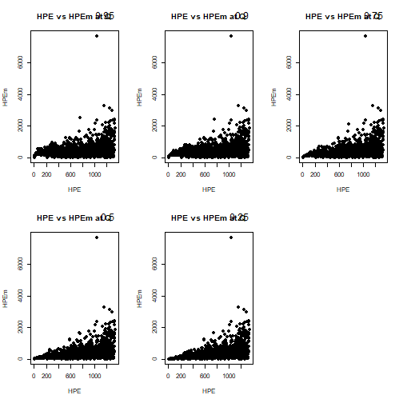


**NOTE**  
 HPEm is hard coded in the function: what if it has another name?  
  also is it always given in a dataset?


```r
quantiles <- c(0.9, 0.8, 0.5, 0.3, 0.1, 0)
sync_hpe2 <- hpe.quantiles(sync_tag_data, "HPE", quantiles)
```

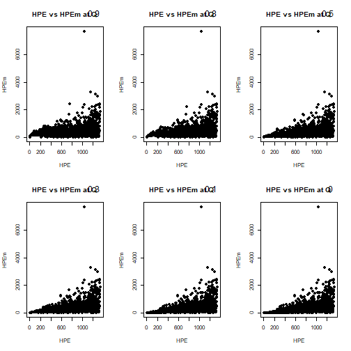

```r
# Testing sync tags summary (with HPE)
sync_summary <- sync.summary(sync_tag_data,"HPE", c(25, 50))
```

```
## Error in subset(sync_tag_data, HPE <= x): object 'sync_tag_data' not found
```

```r
# Testing graph of detections per receiver
receiver.detections(sync_tags=sync_tag_data, sync_hpe_col_name="HPE", num_bins=7,
                    lat_col_name="Latitude", long_col_name="Longitude")
```

```
## Warning in ans * length(l): NAs produced by integer overflow
```

```
## Error: cannot allocate vector of size 68.2 Gb
```

```r
# Testing graph of animal detections
receiver.detections(animal_tags=animal_tag_data, ani_hpe_col_name="HPE", num_bins=7,
                    lat_col_name="Latitude", long_col_name="Longitude")
```

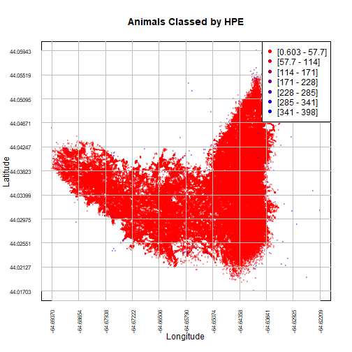

```r
# Testing if you do both
receiver.detections(sync_tags=sync_tag_data, sync_hpe_col_name="HPE",
                    animal_tags=animal_tag_data, ani_hpe_col_name="HPE",
                    num_bins=7, lat_col_name="Latitude", long_col_name="Longitude")
```

```
## Warning in ans * length(l): NAs produced by integer overflow
```

```
## Error: cannot allocate vector of size 68.2 Gb
```

```r
# Testing animal positions graph
animal.positions(animal_tags=animal_tag_data, ani_hpe_col_name="HPE",
                 lat_col_name="Latitude", long_col_name="Longitude",
                 num_bins=6, ID=18032)
```

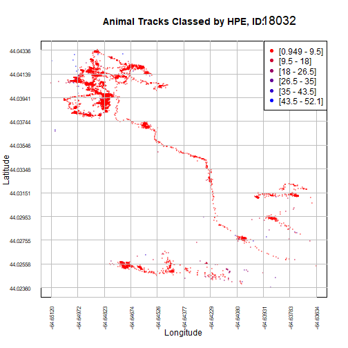

```r
# Testing if you can put them in a loop
anipos_id <- c(15048, 18032, 15100, 15075, 15086)
for(x in anipos_id) {
  animal.positions(animal_tags=animal_tag_data, ani_hpe_col_name="HPE",
                   lat_col_name="Latitude", long_col_name="Longitude",
                   num_bins=6, ID=x)
}
```

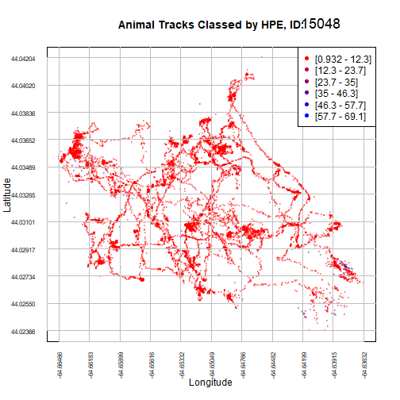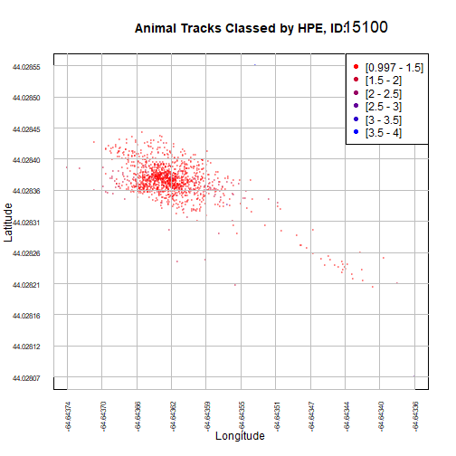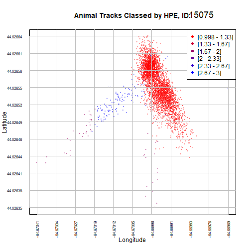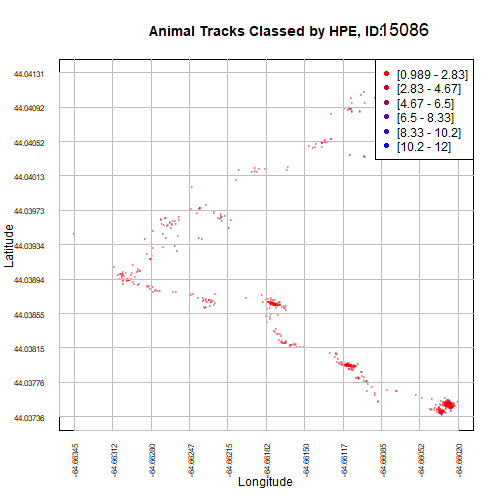

```r
# Number of observations left as a function of week/month
subset_15048 <- subset(animal_merged, animal_merged[, "Id"] == 15048)
timeframe_test_15048 <- num.obs.per.tag(subset_15048, "Id",
                                        metadata=metadata,
                                        start_date="2022-06-30", end_date="2020-10-24",
                                        time_interval="month", time_col_name="Time")

# Number/percent of observations removed with each strategy
#strategy 1, over 200 observations and HPE<25
strat1 <- subset(animal_merged,
                  animal_merged[, "Id"] == 15048 & animal_merged[, "HPE"] <= 25)
strat1 <- num.obs.per.tag(strat1, "Id",
                          metadata=metadata,
                          start_date="2022-06-30", end_date="2020-10-24",
                          time_interval="month", time_col_name="Time")
# Percent remaining
remaining <- strat1 / timeframe_test_15048 *100
```

